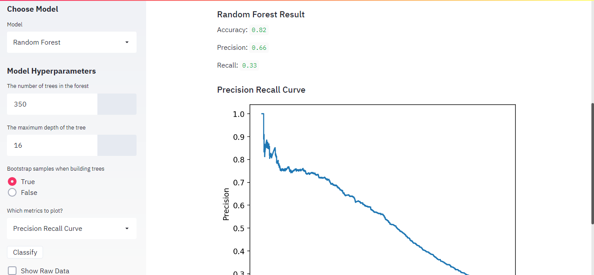

# Credit Card Clients Default Web App

Have a look at it -

Deployed on Heroku - https://creditcardclientsdefault.herokuapp.com/ (Sometimes it may not work due to limited dynos in free tier on Heroku)

Deployed on Streamlit Share - https://share.streamlit.io/ashaabrizvi/credit_card_clients_default/creditcard.py

This App is meant to check how effective our model is for Credit Card Default Prediction with the help of evaluation metrices.

The evaluation metrices used here are - 
1. Confusion Matrix
2. ROC Curve
3. Precision Recall Curve

Also, along with Accuracy, there is a precision and recall score as per the model hyperparameters.

For Logistic Regression, The Model Hyperparameters are - 

1. C(Regularization Parameter) 
2. Max no. of iterations.

For Random Forest, The Model Hyperparameters are - 

1. No. of trees in forest
2. Depth of trees 
3. Bootstrap sample(True/False).

So, tune the Hyperparameters and choose the evaluation metrices and then click on Classify.

Also, You can go through the Raw Data by clicking on Show Raw Data.

Here are some screenshots from the App.

